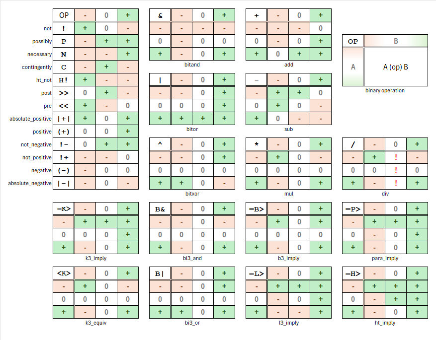

# Version 1.2.1

|                  |                            |
|------------------|----------------------------|
| Label            | Documentation enhancements |
| Type             | Revision                   |
| Publication date | WIP                        |

- **Updated** : replaced the code example with an image of truth tables in `README.md`.

> This is a documentation update.
> 
> 