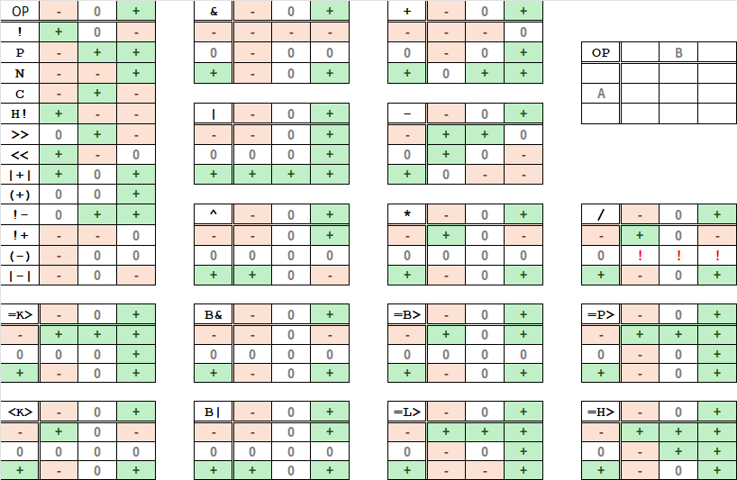

[](https://github.com/Trehinos/balanced-ternary/actions/workflows/rust.yml)

# Balanced Ternary

**Balanced Ternary** is a Rust library for manipulating
**[balanced ternary](https://en.wikipedia.org/wiki/Balanced_ternary)**
numbers, a numeral system with digits `-1`, `0`, and `+1`.

This system is particularly useful in specialized computing applications such as reversible computing, digital signal
processing, and three-valued logic modeling.

## Features

- **No Standard Library:** Suitable for `#![no_std]` environments.
- **Number Conversions:** Convert between decimal and balanced ternary representations.
- **Arithmetic Operations:** Support for addition, subtraction, multiplication, and division.
- **[Three-value Logic Operations](https://en.wikipedia.org/wiki/Three-valued_logic):**
    - Support for bitwise and, or, xor, and not (in Kleene algebra (K3)).
    - **Advanced logic**: Implementation of
      [K3](https://en.wikipedia.org/wiki/De_Morgan_algebra#Kleene_algebra),
      [BI3](https://en.wikipedia.org/wiki/Many-valued_logic#Bochvar's_internal_three-valued_logic),
      [L3](https://en.wikipedia.org/wiki/%C5%81ukasiewicz_logic),
      [RM3](https://en.wikipedia.org/wiki/Paraconsistent_logic#An_ideal_three-valued_paraconsistent_logic),
      [paraconsistent-logic](https://en.wikipedia.org/wiki/Paraconsistent_logic#An_ideal_three-valued_paraconsistent_logic)
      and [HT](https://en.wikipedia.org/wiki/Intermediate_logic) imply operation,
      and some more HT, BI3, L3 and post-logic operations.
- **Custom Representation:** Parse and display numbers using `+`, `0`, and `-` symbols by default, or custom ones.

### Library `features`

All features are enabled by default.

To enable only some features, use the `default-features` option
in your [dependency declaration](https://doc.rust-lang.org/cargo/reference/features.html#dependency-features):

```toml
[dependencies.balanced-ternary]
version = "*.*"
default-features = false
# Choose which one to enable
features = ["ternary-string", "tryte", "ternary-store"]
```

#### Featureless

Without any feature, this library provide the type `Digit` and all its operations and the trait `DigitOperate`.

#### Feature `ternary-string`

Add the structure `Ternary` which is a vector of `Digits` and a lot of utilities
to manipulate digits into the ternary number.
Implements `DigitOperate`.

#### Feature `tryte`

> Needs the feature `ternary-string`.

Add the type `Tryte<N>` which is a fixed size copy-type ternary number.
Implements `DigitOperate`.

#### Feature `ternary-store`

> Needs the feature `ternary-string`.

Add structures to store ternaries efficiently. These types are provided:

- `DataTernary`: a variable length ternary number stored into `TritsChunk`s,
- `TritsChunk`: a fixed size copy-type 5 digits stored into one byte,
- `Ter40`: a fixed size copy-type 40 digits stored into one 64 bits integer. Implements `DigitOperate`.

## Three-valued logic

The library supports numerous three-valued logic operations, each of them having its own specificities:

- **K3** (Kleene logic)  
  A three-valued logic that introduces an "unknown" (0) state, useful for dealing with partial information.
- **BI3** (Bochvar logic)  
  A logic designed to handle "nonsense" or meaningless statements, where 0 represents an invalid or undefined value.
- **L3** (Łukasiewicz logic)  
  A non-classical logic allowing for degrees of truth, often used in fuzzy logic and multi-valued reasoning.
- **RM3** (Routley-Meyer paraconsistent logic)  
  A logic that tolerates contradictions without collapsing into triviality, useful in paraconsistent reasoning.
- **HT** (Heyting logic-inspired ternary system)  
  A variant of intermediate logic, often related to intuitionistic logic and constructive reasoning.
- **Paraconsistent logic**  
  A logic framework that avoids the principle of explosion, allowing systems to work with contradictory information.
- **Post logic**  
  A logical system that extends classical logic with additional operators to handle uncertainty in a structured way.

### Digits operations

### Digits operations

The library provides a variety of operations that can be performed on individual balanced ternary digits. These
operations include logical operations, arithmetic operations, and utility functions that are useful for manipulating
ternary numbers at the digit level. Below are the truth table of these operations:



You can use these operations with the `DigitOperate` trait methods,  
`each_*` (`with`, `zip`, `zip_carry`):

```rust
#[cfg(feature = "ternary-string")]
fn test_each() {
    use crate::*;
    let ternary = Ternary::parse("+0-");
    assert_eq!(ternary.each(Digit::possibly).to_string(), "++-");
}
```

## Examples

### Convert between decimal and balanced ternary

```rust
use balanced_ternary::*;

fn test() {
    let ternary = Ternary::from_dec(5);
    assert_eq!(ternary.to_string(), "+--");

    let ternary = Ternary::parse("+--");
    assert_eq!(ternary.to_dec(), 5);

    let ternary = "+-0".parse::<Ternary>().unwrap();
    assert_eq!(ternary.to_string(), "+-0");
}
```

### Perform arithmetic or logic operations

```rust
use balanced_ternary::*;

fn test() {
    let a = Ternary::from_dec(9);
    let b = Ternary::from_dec(4);
    let sum = &a + &b;
    assert_eq!(sum.to_string(), "+++");
    assert_eq!(sum.to_dec(), 13);

    let bitwise = &Ternary::parse("++00") & &Ternary::parse("0000");
    assert_eq!(bitwise.to_string(), "0000");

    let bitwise = &Ternary::parse("++00") & &Ternary::parse("0+00");
    assert_eq!(bitwise.to_string(), "0+00");

    let bitwise = &Ternary::parse("+000") | &Ternary::parse("000-");
    assert_eq!(bitwise.to_string(), "+000");


    let bitwise = &Ternary::parse("+000") & &Ternary::parse("000-");
    assert_eq!(bitwise.to_string(), "000-");

    let bitwise = &Ternary::parse("+000") | &Ternary::parse("000+");
    assert_eq!(bitwise.to_string(), "+00+");
}
```

### Handle negative numbers

```rust
use balanced_ternary::*;

fn test() {
    let negative = Ternary::from_dec(-5);
    assert_eq!(negative.to_string(), "-++");
}
```

### Iterate through digits

```rust
use balanced_ternary::*;

fn test() {
    let ternary = Ternary::parse("+0-");

    // Using `.iter()`
    let v: Vec<Digit> = ternary.iter().cloned().collect();
    assert_eq!(v, vec![Pos, Zero, Neg]);

    // Using `IntoIterator`
    let v: Vec<Digit> = Ternary::parse("+0-").into_iter().collect();
    assert_eq!(v, vec![Pos, Zero, Neg]);
}
```

## Documentation

The complete API documentation can be found [on docs.rs](https://docs.rs/balanced-ternary).
There you can find descriptions and examples of available types and methods.

## License

Copyright (c) 2025 [Sébastien GELDREICH](mailto:dev@trehinos.eu)  
`Balanced Ternary` is licensed under the [MIT License](LICENSE).
